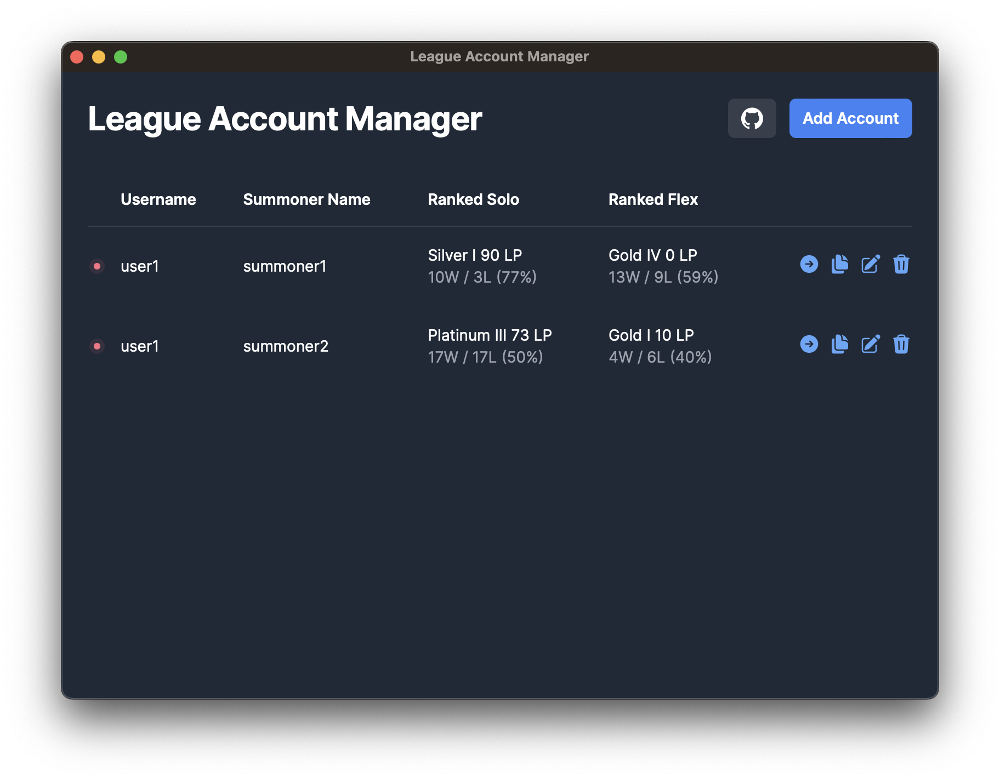

  <h1 align="center">League Account Manager</h1>
  <h3>Manage your League of Legends accounts with ease</h3>

 

League Account Manager is an account storage and management tool for players with multiple League of Legends accounts. Its primary purpose is to provide users with a swift overview of their account ranks, eliminating the need to constantly switch between them. Additionally, the app streamlines the process of switching accounts by enabling users to log in with just a single click.

## 📷 Screenshots

## 🛠️ Tech Stack

- [ Tauri](https://tauri.app/)
- [ Vite](https://vitejs.dev/)
- [ React](https://react.dev/)
- [ Tailwind](https://tailwindcss.com/)

## 🤝 Contributing

League Account Manager is an open-source project and contributions from the community are welcome!

Please read the [Contributing Guide](CONTRIBUTING.md) to get started.

## 📝 Disclaimer

League Account Manager isn't endorsed by Riot Games and doesn't reflect the views or opinions of Riot Games or anyone officially involved in producing or managing Riot Games properties. Riot Games, and all associated properties are trademarks or registered trademarks of Riot Games, Inc.
